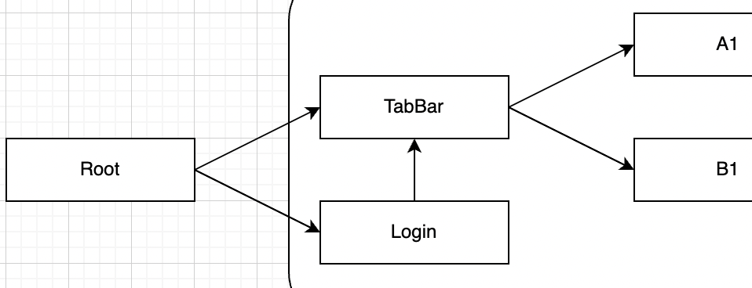

# 개요

TCA를 공부하고 나서 내가 느낀 TCA의 단점은 하나이다. Feature에 파편화에 따른 관리의 복잡함.

이 단점을 보완하고자 생각한 [아이디어](https://github.com/kiryun/TIL/blob/master/Apple/TCA/TCA_101_after.md#%EC%8B%9C%EB%8F%84%ED%95%B4%EB%B3%BC%EB%A7%8C%ED%95%9C-%EA%B2%83%EB%93%A4)가 있는데 각 Feature의 모듈화이다.
아래는 해당내용의 PoC(Proof of Concept)이다.

### 전체적인 App Feature 구조 및 View Flow


* Root
  * 모든 Feature들을 통합해서 하나의 App을 만들어준다.
* Login
  * Root에서 바로 MainFeature(TabBar)로 넘어가는 앱은 드물다. 보통은 Login 성공 시 MainView를 보여준다.
  * 이 경우 Login -> TabBar사이의 데이터 이동은 어떻게 되는지 한번 보도록 한다.
* TabBar
  * MainFeature 역할을 한다. 실제 앱의 전반적인 Feature를 갖고 있다.
* A ~ B
  * TabBar 아래에 있는 Feature(View)들

### Dependency Architecture (with SwiftPM)


* [Composable Architecture](https://github.com/pointfreeco/swift-composable-architecture)
  * SwiftPM( .static )
* Effects
  * SwiftPM( .dynamic )
  * Effects는 TCA를 dependency로 갖고 있다.
  * Effects에는 외부 dependency를 정의하고 있다.
* A ~ B
  * SwiftPM( .static )
  * App의 핵심 Feature들. 각 Feature들은 Effects를 dependency로 갖고 있다.
*  Modular-TCA
  * .xcodeproj
  * 실제 App을 구동시키는 프로젝트.
  * TabBar와 Login을 갖고 있다.
  * Login은 Login 기능을 담당하고 있으며, 처음 App을 실행하면 가장 먼저 마주하는 기능이다. Login에 성공하면 TabBar로 변경된다.
  * TabBar는 App의 핵심 View들을 표출한다.

### 이번 프로젝트에서 봐야 할 주요 포인트

* 모둘화(SPM) + TCA
* TCA에서 View간의 통신 
  * 같은 레벨에서의 통신
  * 서로 다른 레벨에서의 통신
    * 상위 -> 하위
    * 하위 -> 상위
  * Package 간의 데이터 통신
* TCA에서 SceneWindow교체
* Package간의 NavigationLink

# 구현

## Environments 

* Target OS
  * iOS 15.2
* Xcode 13.2.1 (13C100)
* MacOS 12.1
* TCA: 0.33.0


## 어떤 App을 만드는가?

Login버튼을 누르면 해당 화면이 변경되고 TabBar를 통해 A1View가 나온다. A\~B View는 [numbersapi](http://numbersapi.com/)에서 `/1` \~ `/4` 으로 요청해서 받은 값을 보여준다.
그 중 B1View는 login할 때 전달 받은 데이터도 같이 표출해준다. A~B는 NavigationView내부에 있다.


## SwiftPM을 이용한 모듈 구성

1. Repository들을 구현하는 Effects Package부터 구현
2. 핵심 Feature 단계인 A ~ B를 구현
3. Root 역할을 하는 프로젝트를 생성해서 package들을 import한다.

### Effects

**Package.swift**

TCA를 github에서 받는게 아니라 path를 통해서 받고 있다.

```swift
.package(
  name: "swift-composable-architecture",
  path: "../swift-composable-architecture"
)
```

[여기](https://forums.swift.org/t/how-to-integrate-tca-framework-as-of-0-1-3/36443) 에서 github에서 직접 package를 받는 것이 안된다고 한다. 따라서 직접 폴더에 TCA를 다운받고 path를 입력해줘야 한다고 한다.


> 이제는 된다고 한다. 아래처럼 하면 github에서 알아서 받아온다.
>
> ```swift
> package(
> 	url: "https://github.com/pointfreeco/swift-composable-architecture",
> 	.upToNextMajor(from: "0.33.0")
> )
> ```

아래 product 부분을 보면 dynamic으로 되어 있는데 이건 나중에 설명하기로 한다. 

```swift
.library(name: "Effects", type: .dynamic, targets: ["Effects"]),
```


```swift
import PackageDescription

let package = Package(
    name: "Effects",
    platforms: [
        .iOS(.v14)
    ],
    products: [
        .library(name: "Effects", type: .dynamic, targets: ["Effects"]),
    ],
    dependencies: [
    
        // MARK: https://forums.swift.org/t/how-to-integrate-tca-framework-as-of-0-1-3/36443 여기서는 안된다고 함.
        // 위 링크는 옛날 자료고 아래처럼 하면 됨
//        package(
//            url: "https://github.com/pointfreeco/swift-composable-architecture",
//            .upToNextMajor(from: "0.33.0")
//        )
        .package(
            name: "swift-composable-architecture",
            path: "../swift-composable-architecture"
        )
    ],
    targets: [
        .target(
            name: "Effects",
            dependencies: [
                .product(name: "ComposableArchitecture", package: "swift-composable-architecture")
            ]),
        .testTarget(
            name: "EffectsTests",
            dependencies: ["Effects"]),
    ]
)

```


**Effects.swift**

Effects는 단순하다. [numbersapi](http://numbersapi.com) 에서 1 ~ 4 에 해당 하는 api를 요청한다. 1은 A1, 2는 A2, ... 이런식으로 각 Feature에서 사용할 예정이다.

Combine 의 `dataTaskPublisher`를 통해 통신을 하고 그 값을 `eraseToEffect()` 를 이용해 Wrapping 한다.

```swift
import Combine
import ComposableArchitecture

public enum ApiError: Error{ ... }

public protocol Effects{
    func numbersApiOne() -> Effect<String, ApiError>
	  ...
}

public class EffectsImpl: Effects{
    public init(){}
    public func numbersApiOne() -> Effect<String, ApiError>{
        guard let url = URL(string: "http://numbersapi.com/1") else{
            fatalError("Error on creating url")
        }
        
        return URLSession.shared.dataTaskPublisher(for: url)
            .mapError{_ in ApiError.downloadError}
            .map(\.data)
            .compactMap{ String(data: $0, encoding: .utf8)}
            .eraseToEffect()
    }
  
  	...
}
```


### A

A package 의 경우에는 하나의 package 내에서 2개 이상의 Feature를 포함하는 예제를 보여주기 위해 만들었다. 포함하고 있는 Feature는 A1, A2이다.

**Package.swift**

집중해서 봐야할 부분은 products에서 library가 `.dynamic`이 아니다.(Effects의 경우에는 `.dynamic`이다. ) A Package는 SPM이 자동으로 선택하고 있다.

그렇다면 왜 Effects는 library type이 `.dynamic`  이고 A는 그렇지 않을까? 만약 Effects가 `.static`이라고 가정했을 때를 보자
A와 B가 Effects를 사용한다고 하면 A와 B의 바이너리에 Effects의 의존 Package가 복사되어 들어가려고 하므로, A와 B 바이너리 내에 중복해서 존재하게 된다. 따라서 이 경우, 컴파일러가 중복된다고 판단하고 컴파일 에러를 발생시킨다.

> Reference
>
> * https://minsone.github.io/ios/mac/swift-package-manager-proxy-modular
> * https://zeddios.tistory.com/1313
> * https://github.com/kiryun/TIL/blob/master/Apple/Framework/DynamicFramework_StaticFramework_StaticLibrary.md

```swift
import PackageDescription

let package = Package(
    name: "A",
    platforms: [.iOS(.v14)],
    products: [.library(name: "A", targets: ["A"])],
    dependencies: [.package(name: "Effects", path: "../Effects")],
    targets: [
        .target(name: "A", dependencies: ["Effects"]),
        .testTarget(name: "ATests", dependencies: ["A"]),
    ]
)
```

**A1Feature.swift**

먼저 Environment를 보자. request와 queue가 Environment 내부에서 정의하고 있다. 의존성 주입이 없다.
사실 A1Feature의 해당 부분은 좋지 못한 방법이다. environment는 항상 Effects의 `nubmersApiOne()` 를 요청하고 있고, 항상 mainQueue에서 동작한다.
사실 live 에서만 사용한다면 문제될게 없다. 그러나 test를 위해 mock data를 사용하려고하면 문제가 된다. 외부에서 test 환경에 대한 데이터를 받을 수 없기 때문이다.
이러면 A1Feature 내부에 test용 mock data를 만들어 줘야 한다.
나중에 BFeature를 만들면서 어떠한 차이가 있는지 보도록 한다.

그리고 봐야하는 부분이 A1Action, A1State 인데 
Modular-TCA App은 Root->TabBar->A1->A2 순으로 View가 이동한다. "Composable" Architecture라는 이름에 맞게 Root는 TabBar를 갖고 있고, TabBar는 나머지 Feature들(A~B)을 갖고 있다. 
A1과 A2를 각각 동일한 level로 볼지 아니면 A1하위에 A2가 있다고 볼지 차이가 있겠지만 현재 A1, A2는 같은 level 상으로 두고 있고, Root, TabBar, A1에서 A2의 데이터에 직접적으로 접근할 수 있는 방법이 없다.(왜냐면 데이터의 흐름에서 접근할 수 있는 부분은 State와 Action인데 현재 A1State, A1Action에는 A2에 대한 내용이 없다.)
어떤게 더 나은 방법인지는 그때 그때 마다 다를듯하지만, 개인적으로는 Root에서 모든 Feature에 접근이 가능해야 하지 않나 싶다.

```swift
import Effects
import ComposableArchitecture

public struct A1State: Equatable{
    public init(){}
    var resultString: String = ""
}

public enum A1Action: Equatable{
    case onAppear
    case dataLoaded(Result<String, ApiError>)
}

public struct A1Environment{
    var request: () -> Effect<String, ApiError> = {
        let effects: Effects = EffectsImpl()
        return effects.numbersApiOne()
    }
    var mainQueue: () -> AnySchedulerOf<DispatchQueue> = {.main}
	  public init(){}
}

public let a1Reducer = Reducer<
    A1State,
    A1Action,
    A1Environment
>{ state, action, environment in
    switch action{
    case .onAppear:
        return environment.request()
            .receive(on: environment.mainQueue())
            .catchToEffect()
            .map(A1Action.dataLoaded)
    case .dataLoaded(let result):
        switch result{
        case .success(let result):
            state.resultString = result
        case .failure(let error):
            break
        }
        return .none
    }
}

func dummyA1Effect() -> Effect<String, ApiError>{
    let dummyString = "test"
    return Effect(value: dummyString)
}
```

**A1View.swift**

A1View에는 딱히 뭐가 없다. NavigiatonView로 A1View를 감쌌고, Effects에서 받아온 값(viewStore.resultString)을 Text로 화면에 보여주고 있다.
그리고 NavigationLink를 이용해 Text 버튼을 누를 경우 A2View로 넘어간다. 따로 A1이 A2에 대한 정보를 갖고 있지 않기 때문에 바로 Store를 생성해서 호출한다.

```swift
import SwiftUI
import ComposableArchitecture
import Effects

public struct A1View: View {
    let store: Store<A1State, A1Action>
    
    public init(store: Store<A1State, A1Action>){
        self.store = store
    }
    
    public var body: some View {
        WithViewStore(self.store){ viewStore in
            NavigationView{
                VStack{
                    Text(viewStore.resultString)
                    NavigationLink {
                        A2View(store: Store(
                            initialState: A2State(resultString: ""),
                            reducer: a2Reducer,
                            environment: A2Environment(
                                request: {EffectsImpl().numbersApiThree()},
                                mainQueue: {.main}
                            )))
                    } label: {
                        Text("open the A2 View")
                    }
                }
                .navigationTitle("A1")
            }
            .onAppear {
                viewStore.send(.onAppear)
            }
        }
    }
}
```


### B1 ~ B2

B1 **Package.swift**

볼건 별로 없고 Effects를 의존성으로 갖고 있고, B2도 사용하기 때문에 B2 도 의존성에 넣었다. 

```swift
import PackageDescription

let package = Package(
    name: "B1",
    platforms: [.iOS(.v14)],
    products: [
        .library(name: "B1", targets: ["B1"])
    ],
    dependencies: [
        .package(name: "Effects", path: "../Effects"),
        .package(name: "B2", path: "../B2")
    ],
    targets: [
        .target(
            name: "B1",
            dependencies: ["Effects", "B2"]),
        .testTarget(
            name: "B1Tests",
            dependencies: ["B1"]),
    ]
)
```

**B1Feature.swift**

```swift
import Effects
import ComposableArchitecture
import B2

public struct B1State: Equatable{
    public var loginData: String = ""
    public var resultString: String = ""
  	// 여기서 B2State를 생성해서 넣어주고 있는데 외부에서 생성해서 넣어도 된다. 다만 지금 상황에서는 어울리지 않는거 같아서 여기서 생성
    public var b2State = B2State(resultString: "")
	  // 외부로 접근이 제한된 변수가 필요하다면 private으로 선언
//    private internalData: String = ""
    public init(){}
}

public enum B1Action{
    case onAppear
    case dataLoaded(Result<String, ApiError>)
    case b2Action(B2Action)
}

public struct B1Environment{
    var request: () -> Effect<String, ApiError>
    var mainQueue: () -> AnySchedulerOf<DispatchQueue>

  	// 의존성 주입을 통해 request, mainQueue를 설정
    public init(
        request: @escaping () -> Effect<String, ApiError>,
        mainQueue: @escaping () -> AnySchedulerOf<DispatchQueue>
    ){
        self.request = request
        self.mainQueue = mainQueue
    }
}

public let b1Reducer = Reducer<
    B1State,
    B1Action,
    B1Environment
// combine을 써서 reducer를 합친다.
>.combine(
  	// b2Reducer도 b1Reducer를 통해 접근이 가능하도록 한다.
    b2Reducer.pullback(
        state: \.b2State,
        action: /B1Action.b2Action,
        environment: { _ in
                // 여기서 B2 Environment에 request, mainQueue를 주입해준다.
                .init(
                    request: EffectsImpl().numbersApiFour,
                    mainQueue: {.main})
        }),
  	// b1에 대한 reducer는 따로 빼준다.
    Reducer{ state, action, environment in
        switch action{
        case .onAppear:
            return environment.request()
                .receive(on: environment.mainQueue())
                .catchToEffect(B1Action.dataLoaded)
        case .dataLoaded(.success(let result)):
            state.resultString = result
            return .none
        case .dataLoaded(.failure(let error)):
            return .none
        default:
            return .none
        }
    }
)
```

**B1View.swift**

이전에 봤던 A1 -> A2 와는 다르게 B1에서 B2를 호출하는 방식은 `scope`를 이용해서 

```swift
import SwiftUI
import ComposableArchitecture
import B2

public struct B1View: View {
    
    let store: Store<B1State, B1Action>
    
    public init(store: Store<B1State, B1Action>){
        self.store = store
    }
    
    public var body: some View {
        WithViewStore(self.store){ viewStore in
            VStack{
                Text("login Data: "+viewStore.loginData)
                Text(viewStore.resultString)
                NavigationLink {
                  	// A package에서 A2를 호출할 때와는 다르게 scope를 사용해서 B2View의 Store를 주입해준다.
                  	// B1에서 정의한 B2State, B2Action을 주입한다.
                    // B2에서 직접만든 state, action 이 아닌 B1에서 갖고 있는 state, action을 넣고 있음.
                    B2View(store: self.store.scope(
                            state: \.b2State,
                            action: B1Action.b2Action
                        ))
                } label: {
                    Text("Open the B2View")
                }
            }
            .navigationTitle("B1")
            .onAppear {
                viewStore.send(.onAppear)
            }
        }
    }
}
```


### Modular-TCA.xcodeproject

이번엔 package가 아닌 `@main`을 갖고 있는 App을 구현할 차례이다.

Root가 TabBar, Login을 갖고 있고, 상황에 따라서 Login에서 TabBar로 SceneWindow가 TabBar로 변경된다. TabBar안에 A1, B1이 있다.



**RootFeature.swift**

State는 login/tabBar에 따라서 View가 변해야 하므로 enum으로 login, tabBar를 만들었고, 각각 State를 연관값으로 갖고 있다.
그리고 처음 View는 login으로 설정한다. 해당 내용은 [tic tac toe](https://github.com/pointfreeco/swift-composable-architecture/tree/main/Examples/TicTacToe)에서 아이디어를 얻었다.

Action도 다른 Feature들과 마찬가지로 하위 Feature에 대한 Action을 갖고 있다.

Reducer도 또한 하위 reducer에 대한 동작을 캐치하기 위해 pullback을 사용한다. 이러면 Login, TabBar 에 대한 동작(reducer)를 Root의 State, Action에서 받을 수 있다.
(pullback은 간단히 말해서 하위 State, Action, Environment를 상위 State, Action, Environment에서 작동할 수 있도록 해주는거다. 그래서 하위 모듈에 대한 reducer를 pullback을 통해 상위 State, Action에 매핑하고 있다.)
마지막으로 Root자체의 reducer를 갖고 있다.

reducer에서 가장 주의깊게 봐야할 점은 LoginAction을 RootFeature에서 정의하고 있다는 건데 RootFeature는 Login, TabBar 둘다 동시에 접근이 가능하다.
즉, login 후 넘겨줘야 하는 data의 이동은 RootFeature에서 담당한다.

LoginFeature에서 발생하는 Action을 RootFeature의 reducer에서 받아서 처리하도록 만들었다.
logIn success action이 들어오면 state는 `.tabBar`로 변경해주고 loginData를 받아와서 TabBar Feature로 넘겨준다.

이처럼 combine으로 하위 모듈을 구성할 수 도 있고, 하위 모듈에 대한  action을 받아서 처리할 수 도 있다.

```swift
import ComposableArchitecture

enum RootState: Equatable{
    case login(LoginState)
    case tabBar(TabBarState)
    
    public init() { self = .login(.init())}
}

enum RootAction{
    case loginAction(LoginAction)
    case tabBarAction(TabBarAction)
}

struct RootEnvironment{}

let rootReducer = Reducer<
    RootState,
    RootAction,
    RootEnvironment
>.combine(
    loginReducer.pullback(
        state: /RootState.login,
        action: /RootAction.loginAction,
        environment: {_ in LoginEnvironmnet()}
    ),
    tabBarReducer.pullback(
        state: /RootState.tabBar,
        action: /RootAction.tabBarAction,
        environment: {_ in TabBarEnvironmnet()}
    ),
    Reducer{ state, action, _ in
        switch action {
        // logIn success action이 들어오면 state는 `.tabBar`로 변경해주고 loginData를 받아와서 TabBar Feature로 넘겨준다.
        case .loginAction(.logIn(.success(let response))):
            state = .tabBar(.init(loginData: response))
            return .none
        case .loginAction:
            return .none
        case .tabBarAction:
            return .none
        }
    }
)
```

**RootView.swift**

State가 case로 되어 있기 때문에 `SwitchStore`를 사용하고 `CaseLet`을 이용한다. Feture에서 enum 으로 정의한 state에 따라서 View가 바뀐다.

```swift
import SwiftUI
import ComposableArchitecture

struct RootView: View {
    let store: Store<RootState, RootAction>
    
    init(store: Store<RootState, RootAction>){
        self.store = store
    }
    
    var body: some View {
        SwitchStore(self.store){
            CaseLet(state: /RootState.login, action: RootAction.loginAction){ store in
                LoginView(store: store)
            }
            CaseLet(state: /RootState.tabBar, action: RootAction.tabBarAction) { store in
                TabBarView(store: store)
            }
        }
    }
}
```

**LoginFeature.swift**

Login쪽에서는 Action만 보면 된다. `logIn`의 성공 여부에 따라 동작하도록 `Result`를 넣었다. (사실 아래 코드는 실패할 일이 없다.)

그리고 reducer에서는 Login에 대한 모든 처리는 rootReducer에서 담당하고 있기 때문에 `return .none`만 넣어준다.

```swift
import Foundation
import ComposableArchitecture

struct LoginState: Equatable{}

enum LoginAction{
    case logIn(Result<String, Never>)
}

struct LoginEnvironmnet{}

let loginReducer = Reducer<
    LoginState,
    LoginAction,
    LoginEnvironmnet
>{ state, action, envrionment in return .none}
```

**LoginView.swift**

```swift
import SwiftUI
import ComposableArchitecture

struct LoginView: View {
    
    let store: Store<LoginState, LoginAction>
    
    var body: some View {
        WithViewStore(self.store){ viewStore in
            VStack{
              	// login 버튼을 누르면 login success action과 함께 "wimes"라는 값을 전달한다.
                Button {
                    viewStore.send(.logIn(.success("wimes")))
                } label: {
                    Text("logIn")
                }
            }
        }
    }
}
```

**TabBarFeature.swift**

TabBar는 Login에서 `loginData` 를 받는다.(정확히는 Login에서 action을 발생시키고 Root에서 데이터를 준다.)
그렇기 때문에 state에 해당 프로퍼티를 선언한다.

그리고  A1, B1에 대한 state, action를 선언해준다.

그리고 reducer에서 각 Feature에 대한 reducer를 pullback을 통해 매핑하고
B1에서 `.onAppear`이 발생하면 B1의 loginData에 현재 `TabBarState`의 `loginData`를 넣어준다.

만약 B2에 대한 action과 state를 핸들링하고 싶다면 State와 Action를 추가하고 Reducer에 pullback을 사용해 각 state, action을  매핑해주면 된다.

여기서 pullback에 대해 다시한번 간단히 설명하자면 하위 Feature에 대한 State, Action을 매핑한다. 그리고 매핑된 State, Action(`TabBarState.a1State`, `TabBarState.b1State`, `TabBarAction.a1Action`, `TabBarAction.b1Action)을 이용해 동작을 정의한다.

```swift
import ComposableArchitecture
import Effects
import A
import B1

struct TabBarState: Equatable{
    var loginData: String
    var a1State = A1State()
    var b1State = B1State()
}

enum TabBarAction{
    case a1Action(A1Action)
    case b1Action(B1Action)
}

struct TabBarEnvironmnet{}

let tabBarReducer = Reducer<
    TabBarState,
    TabBarAction,
    TabBarEnvironmnet
>.combine(
    a1Reducer.pullback(
        state: \.a1State,
        action: /TabBarAction.a1Action,
        environment: { _ in
                .init()
        }),
    b1Reducer.pullback(
        state: \.b1State,
        action: /TabBarAction.b1Action,
        environment: { _ in
                .init(
                    request: {EffectsImpl().numbersApiTwo()},
                    mainQueue: {.main}
                )
        }),
    Reducer{state, action, _ in
        switch action{
        case .b1Action(.onAppear):
            state.b1State.loginData = state.loginData
            return .none
        default:
            return .none
        }
    }
)
```

**TabBarView.swift**

>  A1에는 NavigationView가 없고 B1에는 있는데 신경 안써도 된다. 뻘짓의 흔적이다.

```swift
import SwiftUI
import ComposableArchitecture
import A
import B1
import B2

struct TabBarView: View {
    let store: Store<TabBarState, TabBarAction>
    
    var body: some View {
        WithViewStore(self.store){ viewStore in
            TabView{
                A1View(store: self.store.scope(
                    state: \.a1State,
                    action: TabBarAction.a1Action
                ))
                    .tabItem {
                        Image(systemName: "list.dash")
                        Text("A")
                    }
                NavigationView{
                    B1View(store: self.store.scope(
                        state: \.b1State,
                        action: TabBarAction.b1Action
                    ))
                }
                .tabItem {
                    Image(systemName: "list.dash")
                    Text("B")
                }
            }
        }
    }
}
```

# 느낀점

모듈화에서 나올 수 있는 [circular dependency](http://minsone.github.io/programming/swift-solved-circular-dependency-from-dependency-injection-container) 확률이 현저히 낮아진다. 
상위 Feature에서 action을 발생시키고, action에 대한 처리가 가능하기 때문.
b1(또는 a1 뭐가 됐든 하위 Feature)에서 b2에 대한 action을 핸들링하거나 state에 접근한다고 하면 Action, State, Reducer를 정의해주면 된다.

composable architecture라는 이름과 걸맞게 모든 feature를 모듈로 빼기 쉬었고, 접근 제어 또한 매우 쉬었다.


