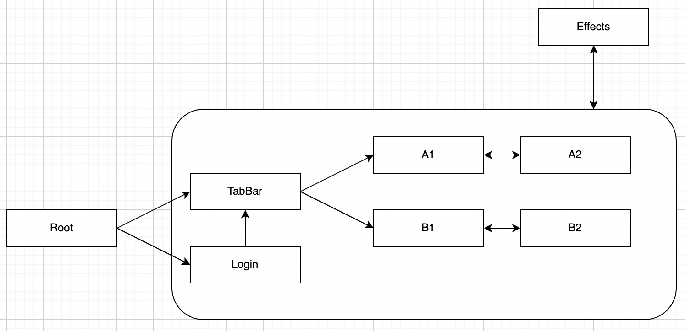
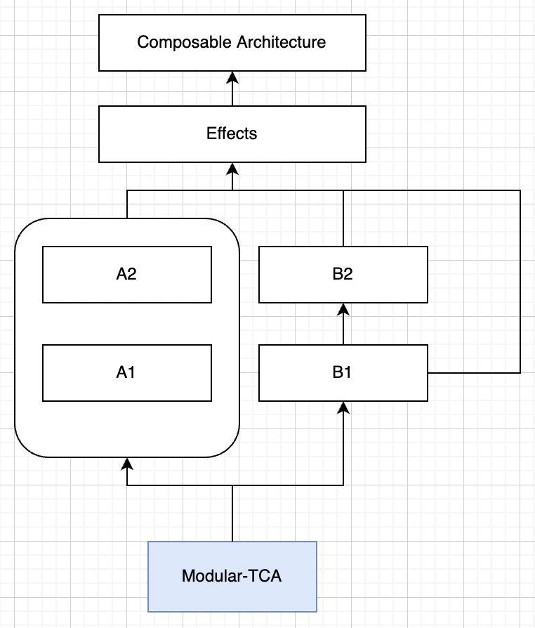
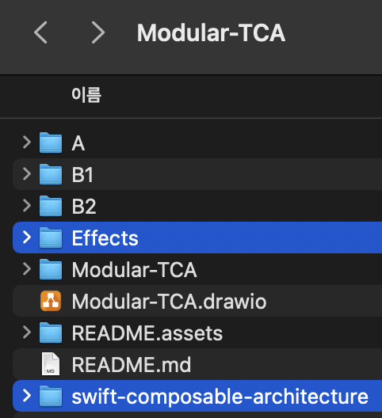

# 개요

TCA를 공부하고 나서 내가 느낀 TCA의 단점은 하나이다. Feature에 파편화에 따른 관리의 복잡함.

이 단점을 보완하고자 생각한 [아이디어](https://github.com/kiryun/TIL/blob/master/Apple/TCA/TCA_101_after.md#%EC%8B%9C%EB%8F%84%ED%95%B4%EB%B3%BC%EB%A7%8C%ED%95%9C-%EA%B2%83%EB%93%A4)가 있는데 각 Feature의 모듈화이다. Tuist를 사용해서 PoC(Proof of Concept)를 해보고자 한다.

### 전체적인 App Feature 구조 및 View Flow



* Root
  * 모든 Feature들을 통합해서 하나의 App을 만들어준다.
* Login
  * Root에서 바로 MainFeature(TabBar)로 넘어가는 앱은 드물다. 보통은 Login 성공 시 MainView를 보여준다.
  * 이 경우 Login -> TabBar사이의 데이터 이동은 어떻게 되는지 한번 보도록 한다.
* TabBar
  * MainFeature 역할을 한다. 실제 앱의 전반적인 Feature를 갖고 있다.
* A ~ B
  * TabBar 아래에 있는 Feature(View)들

### Dependency Architecture (with SwiftPM)



* [Composable Architecture](https://github.com/pointfreeco/swift-composable-architecture)
  * SwiftPM( .static )
* Effects
  * SwiftPM( .dynamic )
  * Effects는 TCA를 dependency로 갖고 있다.
  * Effects에는 외부 dependency를 정의하고 있다.
* A ~ B
  * SwiftPM( .static )
  * App의 핵심 Feature들. 각 Feature들은 Effects를 dependency로 갖고 있다.
*  Modular-TCA
  * .xcodeproj
  * 실제 App을 구동시키는 프로젝트.
  * TabBar와 Login을 갖고 있다.
  * Login은 Login 기능을 담당하고 있으며, 처음 App을 실행하면 가장 먼저 마주하는 기능이다. Login에 성공하면 TabBar로 변경된다.
  * TabBar는 App의 핵심 View들을 표출한다.

### 이번 프로젝트에서 봐야 할 주요 포인트

* 모둘화(SPM) + TCA
* TCA에서 View간의 통신 
  * 같은 레벨에서의 통신
  * 서로 다른 레벨에서의 통신
    * 상위 -> 하위
    * 하위 -> 상위
  * Package 간의 데이터 통신
* TCA에서 SceneWindow교체
* Package간의 NavigationLink

# 구현

## Environments 

* Target OS
  * iOS 15.2
* Xcode 13.2.1 (13C100)
* MacOS 12.1
* TCA: 0.33.0


## 어떤 App을 만드는가?


## SwiftPM을 이용한 모듈 구성

1. Repository들을 구현하는 Effects Package부터 구현
2. 핵심 Feature 단계인 A ~ B를 구현
3. Root 역할을 하는 프로젝트를 생성해서 package들을 import한다.

### Effects

**Package.swift**

TCA를 github에서 받는게 아니라 path를 통해서 받고 있다.

```swift
.package(
  name: "swift-composable-architecture",
  path: "../swift-composable-architecture"
)
```

[여기](https://forums.swift.org/t/how-to-integrate-tca-framework-as-of-0-1-3/36443) 에서 github에서 직접 package를 받는 것이 안된다고 한다. 따라서 직접 폴더에 TCA를 다운받고 path를 입력해줘야 한다고 한다.



> 이제는 된다고 한다. 아래처럼 하면 github에서 알아서 받아온다.
>
> ```swift
> package(
> 	url: "https://github.com/pointfreeco/swift-composable-architecture",
> 	.upToNextMajor(from: "0.33.0")
> )
> ```

아래 product 부분을 보면 dynamic으로 되어 있는데 이건 나중에 설명하기로 한다. 

```swift
.library(name: "Effects", type: .dynamic, targets: ["Effects"]),
```


```swift
// swift-tools-version:5.5
// The swift-tools-version declares the minimum version of Swift required to build this package.

import PackageDescription

let package = Package(
    name: "Effects",
    platforms: [
        .iOS(.v14)
    ],
    products: [
        .library(name: "Effects", type: .dynamic, targets: ["Effects"]),
    ],
    dependencies: [
    
        // MARK: https://forums.swift.org/t/how-to-integrate-tca-framework-as-of-0-1-3/36443 여기서는 안된다고 함.
        // 위 링크는 옛날 자료고 아래처럼 하면 됨
//        package(
//            url: "https://github.com/pointfreeco/swift-composable-architecture",
//            .upToNextMajor(from: "0.33.0")
//        )
        .package(
            name: "swift-composable-architecture",
            path: "../swift-composable-architecture"
        )
    ],
    targets: [
        .target(
            name: "Effects",
            dependencies: [
                .product(name: "ComposableArchitecture", package: "swift-composable-architecture")
            ]),
        .testTarget(
            name: "EffectsTests",
            dependencies: ["Effects"]),
    ]
)

```


**Effects.swift**

Effects는 단순하다. [numbersapi](http://numbersapi.com) 에서 1 ~ 4 에 해당 하는 api를 요청한다. 1은 A1, 2는 A2, ... 이런식으로 각 Feature에서 사용할 예정이다.

Combine 의 `dataTaskPublisher`를 통해 통신을 하고 그 값을 `eraseToEffect()` 를 이용해 Wrapping 한다.

```swift
import Combine
import ComposableArchitecture

public enum ApiError: Error{ ... }

public protocol Effects{
    func numbersApiOne() -> Effect<String, ApiError>
	  ...
}

public class EffectsImpl: Effects{
    public init(){}
    public func numbersApiOne() -> Effect<String, ApiError>{
        guard let url = URL(string: "http://numbersapi.com/1") else{
            fatalError("Error on creating url")
        }
        
        return URLSession.shared.dataTaskPublisher(for: url)
            .mapError{_ in ApiError.downloadError}
            .map(\.data)
            .compactMap{ String(data: $0, encoding: .utf8)}
            .eraseToEffect()
    }
  
  	...
}
```


### A

### B1 ~ B2

### .xcodeproject


## Tuist를 이용한 구조 세팅

### 만들고자 하는 구조

* Modular-TCA.xcworkspace

  * <details>
      <summary>Modular-TCA.xcdoeproj</summary>
      - AppMain.swift(@main)
    </details>

    * <details>
        <summary>Modular-TCA</summary>
        - RootView.swift<br>
        - RootFeature.swift
      </details>

    * <details>
        <summary>Modular-TCATests</summary>
        - Modular-TCATests.swift
      </details>

  * Login.xcdoeproj

    * <details>
        <summary>Login</summary>
      </details>

    * <details>
        <summary>LoginTests</summary>
      </details>

  * TabBar.xcdoeproj

  * A.xcdoeproj

  * A'.xcdoeproj

  * B.xcdoeproj

  * B'.xcdoeproj

  * Effects.xcodeproj ( dynamic framework )

    * Effects.swift


